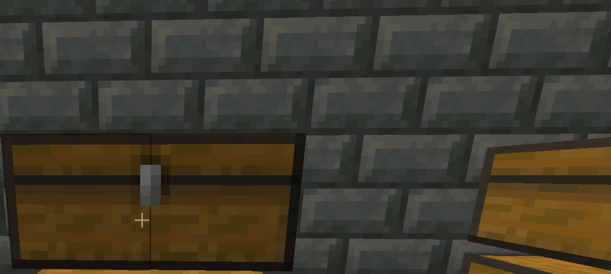

# 📦 Chest Separators | Visual Inventory Organization

**Chest Separators** is a lightweight, client-side utility mod designed to enhance inventory management UX without altering server-side data. Unlike traditional mods that require crafting physical items (wasting inventory slots), this project implements a **Virtual Overlay System**, allowing users to draw visual dividers directly onto the container GUI.

> **⚠️ Engineering Focus**
> This project demonstrates advanced **Java Bytecode Manipulation** using Mixins for rendering hooks and implements a custom **HSV-to-RGB Color Engine** for real-time dynamic palette generation.

---

## 📸 Interface & Workflow (v1.1 Update)

The user experience focuses on fluidity ("Drag & Paint") and deep customization via the new RGB Engine.

### 1. Modular UI Architecture
New in v1.1: Layered UI rendering with depth control. The editor now floats independently over the container grid, preventing Z-fighting artifacts.

 

### 2. HSV Color Engine & Persistence
Moving away from static byte arrays, the mod now uses real-time `Math.hsvToRgb` conversion. Users can generate any color (16.7M possibilities) and persist them into custom NBT slots.

 

### 3. Raycast Drag & Paint
Utilizes a custom slot-hitting algorithm to allow fluid "painting" across the GUI. Updates are rendered in real-time on the client tick event, ensuring zero input lag.

 

### 4. NBT Clipboard Serialization
Implements a deep-copy mechanism. Complex layouts are serialized into NBT data to replicate designs across multiple containers (Chests, Barrels, Shulkers) instantly.

 

### 5. State Management Tools
Precise control over the visual layer. The **Smart Eraser** modifies specific bits in the array, while the **Trash Can** triggers a full array reset for the container.

---

## 🏗️ Technical Architecture

The core engineering challenge in v1.1 was integrating a complex UI state (Color Picker) while maintaining the zero-conflict rendering pipeline.

### The Rendering Pipeline (Dual-Layer Strategy)
To achieve the visual effect where lines appear *behind* items but *above* the background texture, the rendering logic is split:
* **Layer 1 (Background):** Injected at the `HEAD` of the `drawSlots` method. This renders the persistent separator data relative to the container's coordinate system.
* **Layer 2 (Transient UI):** The new v1.1 Editor and Color Picker are rendered at the `TAIL` of the render loop. This ensures high Z-Index priority for the floating windows and tooltips.

### Context-Aware Persistence
The mod employs a **Polymorphic Data Strategy** to save configurations:
* **Static Blocks:** Uses `BlockPos` + `DimensionID` to create unique NBT files.
* **Dynamic Entities:** Detects if the inventory belongs to an entity (e.g., Llama, Minecart) and uses the entity's persistent `UUID`.

---

## 💻 Installation & Setup

1.  **Prerequisites:** Install [Minecraft Java Edition](https://www.minecraft.net/) and [Fabric Loader](https://fabricmc.net/).
2.  **Fabric API:** Ensure the [Fabric API](https://modrinth.com/mod/fabric-api) is installed.
3.  **Deployment:** Drop the `ChestSeparators-v1.1.0.jar` file into your `.minecraft/mods` folder.
4.  **Usage:** Open any chest and click the **Pencil (✎)** icon to access the new UI.

---
*Looking for the source code? Check the `src` folder for the Mixin implementation.*
