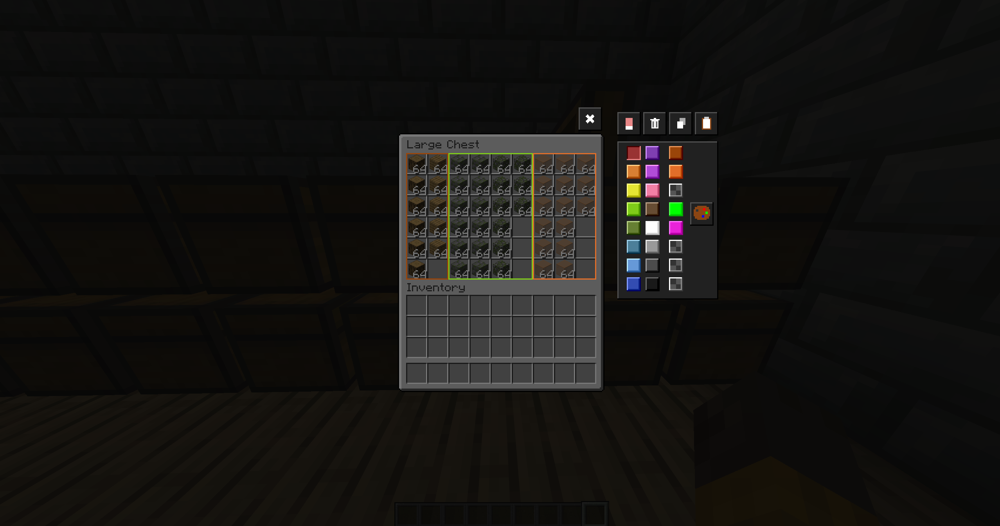
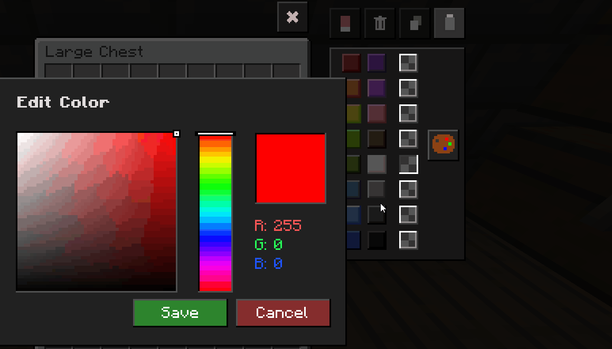
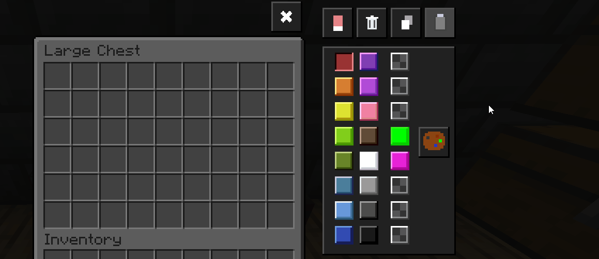
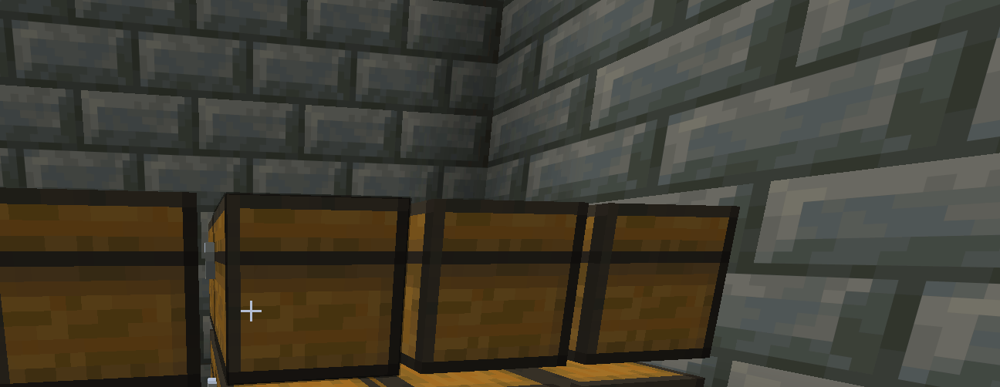

# 📦 Chest Separators | Visual Inventory Organization

**Chest Separators** is a lightweight, client-side utility mod designed to enhance inventory management UX without altering server-side data. Unlike traditional mods that require crafting physical items (wasting inventory slots), this project implements a **Virtual Overlay System**, allowing users to draw visual dividers directly onto the container GUI.

> **⚠️ Engineering Focus**
> This project demonstrates advanced **Java Bytecode Manipulation** using Mixins for rendering hooks and implements a custom **HSV-to-RGB Color Engine** for real-time dynamic palette generation.

---

## 📸 Interface & Workflow (v1.1 Update)

The user experience focuses on fluidity ("Drag & Paint") and deep customization via the new RGB Engine.

| **Modular UI Architecture** | **HSV Color Engine** |
| :---: | :---: |
|  |  |
| *New in v1.1: Layered UI rendering with depth control. The editor now floats independently over the container grid.* | *Real-time color math. Users can manipulate Hue/Saturation/Value to generate any RGB color and save it to custom NBT slots.* |

| **Raycast Drag & Paint** | **NBT Serialization** |
| :---: | :---: |
|  |  |
| *Fluid input handling. Custom slot-hitting algorithm allows for instant painting without input lag.* | *Deep-Copy Clipboard. Serializes the entire visual layout into NBT to replicate designs across multiple containers.* |

---

## 🏗️ Technical Architecture

The core engineering challenge in v1.1 was integrating a complex UI state (Color Picker) while maintaining the zero-conflict rendering pipeline.

### 1. The Rendering Pipeline (Dual-Layer Strategy)
To achieve the visual effect where lines appear *behind* items but *above* the background texture, the rendering logic is split:
* **Layer 1 (Background):** Injected at the `HEAD` of the `drawSlots` method. This renders the persistent separator data relative to the container's coordinate system.
* **Layer 2 (Transient UI):** The new v1.1 Editor and Color Picker are rendered at the `TAIL` of the render loop. This ensures high Z-Index priority for the floating windows and tooltips, preventing them from being obscured by items.

### 2. Dynamic Color Model (New in v1.1)
Moving away from the static 16-color byte array, the mod now implements a hybrid storage system:
* **Legacy Support:** Basic colors are still stored as efficient 4-bit integers.
* **RGB Expansion:** Custom colors are serialized as 32-bit Integers (ARGB) within a separate NBT compound, allowing for 16.7 million colors without bloating the file size.
* **Math:** The picker uses real-time `Math.hsvToRgb` conversion algorithms to render the gradient texture dynamically on the client tick.

### 3. Context-Aware Persistence
The mod employs a **Polymorphic Data Strategy** to save configurations:
* **Static Blocks:** Uses `BlockPos` + `DimensionID` to create unique NBT files for chests and barrels.
* **Dynamic Entities:** Detects if the inventory belongs to an entity (e.g., Llama, Minecart) and switches strategy to use the entity's persistent `UUID`.

---

## 🚀 Key Features

### 🎨 Non-Destructive Visualization
* **Zero Slot Waste:** Separators are purely visual client-side renderings. They do not exist as items, leaving 100% of the inventory available for storage.
* **Server-Agnostic:** Works on any multiplayer server (Vanilla, Spigot, Modded) as no packets are sent to the server.

### 🛠️ Professional Editor Suite
* **RGB Color Picker:** Full spectrum selection with brightness control and hex-code display.
* **Custom Palette Slots:** Save up to 8 custom colors to your local config for quick access.
* **Smart Erase & Clipboard:** Context-sensitive tools to modify or replicate layouts instantly.

### ⚡ Performance Optimization
* **Lazy Loading:** Configuration data is only loaded from disk (NBT I/O) when a specific container is opened.
* **Bitwise Packing:** Line data is compressed into efficient integer bitmasks rather than heavy objects to minimize RAM usage.

---

## 💻 Installation & Setup

1.  **Prerequisites:** Install [Minecraft Java Edition](https://www.minecraft.net/) and [Fabric Loader](https://fabricmc.net/).
2.  **Fabric API:** Ensure the [Fabric API](https://modrinth.com/mod/fabric-api) is installed.
3.  **Deployment:** Drop the `ChestSeparators-v1.1.0.jar` file into your `.minecraft/mods` folder.
4.  **Usage:** Open any chest and click the **Pencil (✎)** icon to access the new UI.

---
*Looking for the source code? Check the `src` folder for the Mixin implementation.*